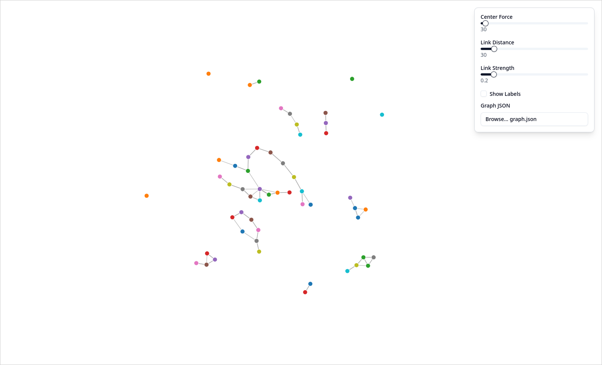
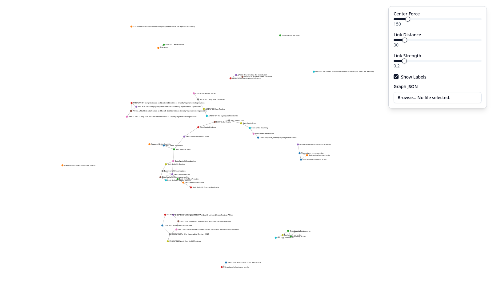

# zk-graphview

An interactive force-directed graph visualization tool for exploring knowledge networks and note connections. zk-graphview
is meant to be used with [zk](https://github.com/zk-org/zk), though you could theoretically use it with any markdown
zettelkasten. This is not recommended as you would (as of right now, might change in the future) have to create your own
JSON file. See this application's Neovim plugin companion [here](https://github.com/sheikhevan/zk-extras.nvim).

Yes, I stole this idea from ObsidianMD and made it open source.





## Features

- **Interactive Force-Directed Graph**: Nodes connected by links that you can interact and play with.
- **Real-time Controls**: Adjust graph behavior like center force and link strength with sliders.
- **File Uploading**: You can upload your own graph JSON either through an input or as a url parameter.
- **Local Storage**: Upon uploading a JSON, it will store that JSON in local storage so you can reload the page and it will
still work.

## Getting Started

#### Prerequisites

- Node.js 18+
- bun, npm, pnpm, whatever man

For the installation I will be using bun, but let it be noted that you could use npm or pnpm as well.

#### Installation

```bash
git clone https://github.com/sheikhevan/zk-graphview.git
cd zk-graphview
bun install
```

#### Running

```bash
bun run build
bun run preview --open
```

#### Running (Development)

```bash
bun run dev --open
```

#### Usage

First, you need to generate a graph JSON, in your zk directory:
```bash
zk graph --format=json > graph.json
```

Then, click the file upload in the app and choose your generated graph.json. <br>
OR <br>
Go to the URL: `https://localhost:4173?graph=path_to_your_json`

## Tech Stack

- TypeScript
- SvelteKit
- d3.js
- Vite
- TailwindCSS
- shadcn/ui (Svelte)

## Contributing

1. Fork the repository
2. Create a new branch (`git checkout -b feature/amazing-feature`)
3. Commit your changes (`git commit -m "I added an AMAZING feature"`)
4. Push to the branch (`git push origin feature/amazing-feature`)
5. Open a Pull Request, i promise I'll look at them.

## License

This project uses the MIT license, see [here](./LICENSE).
